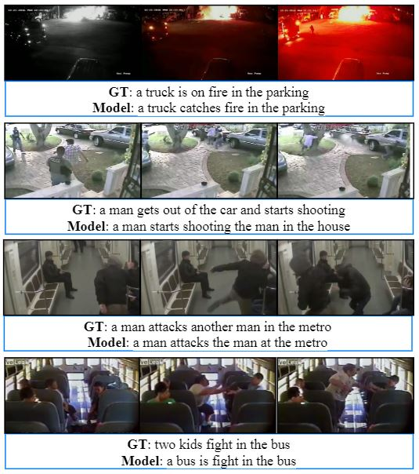

## Captionomaly: A Deep Learning Toolbox for Anomaly Captioning in Social Surveillance Systems

### <a name = "Description"> </a> Description
This repository is the source code for the paper "Captionomaly: A Deep Learning Toolbox for Anomaly Captioning in Surveillance Videos". 

**Abstract:** Video stream monitoring and reporting can be a tedious task if one has to go through several hours of clippings on a daily basis. It also leaves room for errors because of the repetitive nature of the task. In this paper, we provide a tool with the aim of automating the process of anomaly detection and reporting. We combine the results of anomaly detection and video captioning models in our application, and introduce a new dataset specific for training the models to be used for surveillance purposes. The anomaly detection framework is trained on the UCF-Crime dataset, and the captioning model is trained on a new dataset we introduced, called UCFC-VD. This tool will be the first of its kind combining the two frameworks for performing the task of video surveillance and reporting efficiently.

The major contributions of our work are:

1. We introduce a new dataset called UCFC-VD (UCF-Crime Video Description) for anomaly captioning purposes.
2. We propose a framework for anomaly detection and video captioning that works efficiently with very small amount of inputs.
3. The framework introduced here can be used as a toolbox to completely automate the process of surveillance of video footage and report any anomaly to the user.



---

### <a name = "Requirements"> </a> Requirements
The individual requirements for both the models are given in the respective directories

---

### <a name = "Testing"> </a> Testing

To test the code on individual samples using the weights from the pre-trained model:

1. Extract [C3D features](https://github.com/facebookarchive/C3D) using the given [script](https://github.com/Adit31/Captionomaly-Deep-Learning-Toolbox-for-Anomaly-Captioning/blob/main/Anomaly_Detection/Feature_Extractor/Feature_Extractor.ipynb) (Ensure dimensions of 240x320 pixels and frame rate of 30 fps).
2. Use the .txt file generated above to get anomaly scores using [Test_Anomaly_Detector_public.py](https://github.com/Adit31/Captionomaly-Deep-Learning-Toolbox-for-Anomaly-Captioning/blob/main/Anomaly_Detection/Test_Anomaly_Detector_public.py) in the [script](https://github.com/Adit31/Captionomaly-Deep-Learning-Toolbox-for-Anomaly-Captioning/blob/main/Anomaly_Detection/CCTV_Anomaly.ipynb).
3. Use the .txt file generated during the testing with [Save_Anomaly_Clips.py](https://github.com/Adit31/Captionomaly-Deep-Learning-Toolbox-for-Anomaly-Captioning/blob/main/Anomaly_Detection/Save_Anomaly_Clips.py) to get the anomalous part of the video.
4. Extract frames from the clipped video using [Prepare_frames.py](https://github.com/Adit31/Captionomaly-Deep-Learning-Toolbox-for-Anomaly-Captioning/blob/main/Video_Captioning/Feature_Extractor/Prepare_frames.py).
5. Extract [ResNeXt-101 features](https://github.com/taehoonlee/tensornets) for the test video using [generate_res_feature.py](https://github.com/Adit31/Captionomaly-Deep-Learning-Toolbox-for-Anomaly-Captioning/blob/main/Video_Captioning/Feature_Extractor/generate_res_feature.py).
6. Use the .npy file generated above to get the tagging vector using [TestTagging.py](https://github.com/Adit31/Captionomaly-Deep-Learning-Toolbox-for-Anomaly-Captioning/blob/main/Video_Captioning/Tagging_Network/TestTagging.py).
7. Use the .npy files for ResNext features and Tagging network in the [run_model.sh](https://github.com/Adit31/Captionomaly-Deep-Learning-Toolbox-for-Anomaly-Captioning/blob/main/Video_Captioning/Delving_Deeper_into_the_Decoder_for_Video_Captioning/run_model.sh).
8. Check the generated caption in the demo log file.

---

### <a name = "Training"> </a>Training
###### Anomaly Detection 
[Real-World Anomaly Detection in Surveillance Videos](https://github.com/WaqasSultani/AnomalyDetectionCVPR2018)

###### Video Captioning
[Delving Deeper into the Decoder for Video Captioning](https://github.com/WingsBrokenAngel/delving-deeper-into-the-decoder-for-video-captioning#requirement)


1. Prepare the Corpus, Reference, Vocabulary and Tagging files using the scripts given [here](https://github.com/Adit31/Captionomaly-Deep-Learning-Toolbox-for-Anomaly-Captioning/tree/main/Video_Captioning/Data_Preparation/Scripts).
2. Extract ResNeXt features of all the videos in a single .npy file using [Prepare_frames.py](https://github.com/Adit31/Captionomaly-Deep-Learning-Toolbox-for-Anomaly-Captioning/blob/main/Video_Captioning/Feature_Extractor/Prepare_frames.py) and [generate_res_feature.py](https://github.com/Adit31/Captionomaly-Deep-Learning-Toolbox-for-Anomaly-Captioning/blob/main/Video_Captioning/Feature_Extractor/generate_res_feature.py).
3. Train the tagging network using [TrainTagNet.py](https://github.com/Adit31/Captionomaly-Deep-Learning-Toolbox-for-Anomaly-Captioning/blob/main/Video_Captioning/Tagging_Network/TrainTagNet.py).
4. Test the tagging network to generate a .npy file using [TestTagging.py](https://github.com/Adit31/Captionomaly-Deep-Learning-Toolbox-for-Anomaly-Captioning/blob/main/Video_Captioning/Tagging_Network/TestTagging.py).
6. Adjust the configurations for the Captioning model in [config.py](https://github.com/Adit31/Captionomaly-Deep-Learning-Toolbox-for-Anomaly-Captioning/blob/main/Video_Captioning/Delving_Deeper_into_the_Decoder_for_Video_Captioning/config.py), and train the Captioning model using [run_model.sh](https://github.com/Adit31/Captionomaly-Deep-Learning-Toolbox-for-Anomaly-Captioning/blob/main/Video_Captioning/Delving_Deeper_into_the_Decoder_for_Video_Captioning/run_model.sh).
7. Check the results the train and test log files.

---

### <a name = "Data"> </a> Data
The dataset download links for the models are given in their respective directories.

---

### <a name = "Citation"> </a> Citation
```
@article{goyal2023captionomaly,
  title={Captionomaly: A Deep Learning Toolbox for Anomaly Captioning in Social Surveillance Systems},
  author={Goyal, Adit and Mandal, Murari and Hassija, Vikas and Aloqaily, Moayad and Chamola, Vinay},
  journal={IEEE Transactions on Computational Social Systems},
  year={2023},
  publisher={IEEE}
}
```
